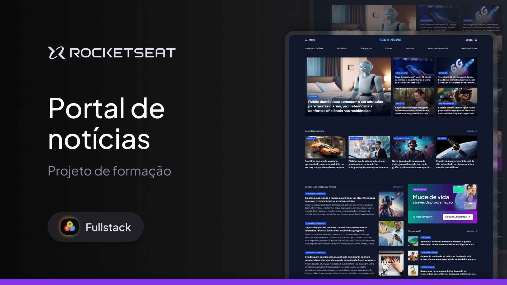

<h1 align="center"> Projeto Portal de notícias</h1>

  <a href="#-tecnologias">Tecnologias</a>&nbsp;&nbsp;&nbsp;|&nbsp;&nbsp;&nbsp;
  <a href="#-projeto">Projeto</a>&nbsp;&nbsp;&nbsp;|&nbsp;&nbsp;&nbsp;
  <a href="#-layout">Layout</a>&nbsp;&nbsp;&nbsp;

  

## 🚀 Tecnologias

Esse projeto foi desenvolvido com as seguintes tecnologias:

- HTML
- CSS
- Figma

## 💻 Projeto

Esse é um dos projetos desenvolvidos em aula na formação Full-stack e trata-se de um portal de notícias para a prática do conhecimento com o Grid.

## 🔖 Layout

Você pode visualizar o layout do projeto através [DESSE LINK](https://www.figma.com/community/file/1362166020452569562). É necessário ter conta no [Figma](https://figma.com) para acessá-lo.
